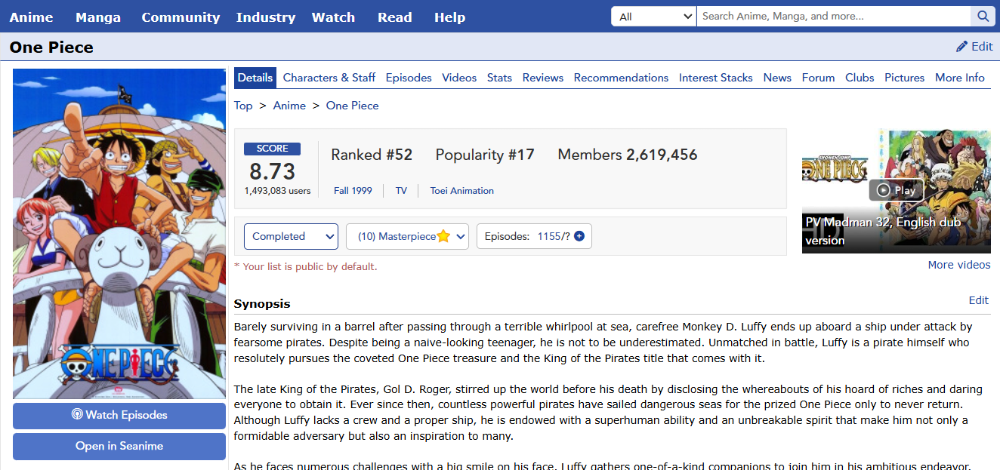
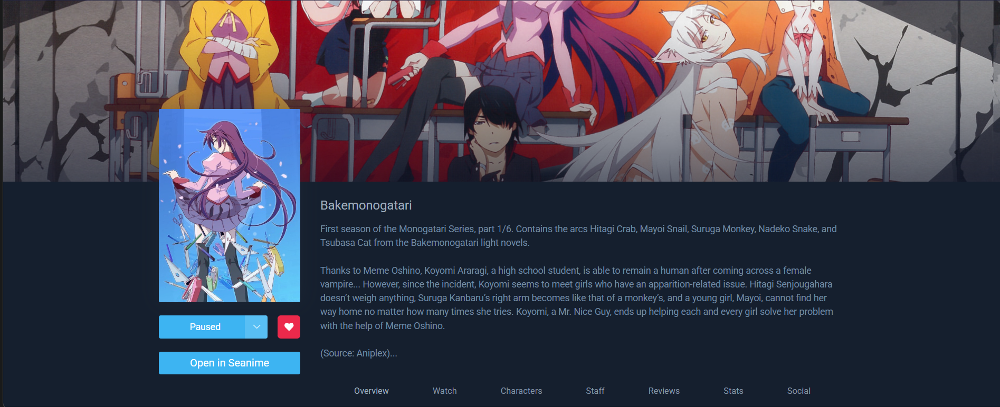

  
  <h1>🚀 Bruuhim's Seanime Extensions</h1>
  
A collection of high-quality extensions and manga providers for the <b>Seanime</b> universe.

  
  
  

## 📖 Table of Contents

- [Manga Providers](#-manga-providers)
- [Featured Extensions](#-featured-extensions)
- [Installation Guide](#-installation-guide)
- [Technical Details](#-technical-details)

## 🔌 Manga Providers

These providers are optimized for stability, featuring AJAX fallbacks and Cloudflare bypass logic.

| Provider              | Description                         | Installation Manifest (URL)                                                                                        |
| :-------------------- | :---------------------------------- | :----------------------------------------------------------------------------------------------------------------- |
| **3asq (Arabic)**     | Premium Arabic manga from 3asq.org  | `https://raw.githubusercontent.com/bruuhim/bruuhim-seanime-extensions/main/manga-providers/3asq/3asq.json`         |
| **LekManga (Arabic)** | Extensive library from lekmanga.net | `https://raw.githubusercontent.com/bruuhim/bruuhim-seanime-extensions/main/manga-providers/lekmanga/lekmanga.json` |

 

## 🧩 Featured Extensions

### [Open-in-Seanime](https://github.com/bruuhim/Open-in-Seanime)

Bridge your anime discovery with your local server. Adds a clean link to media on MyAnimeList and AniList.

  
  

### [MAL-Button-Seanime](https://github.com/bruuhim/MAL-Button-Seanime)

Seamlessly adds a native-feeling "Watch on Seanime" button directly into the MyAnimeList sidebar.

  

 

## 🛠 Installation Guide

1. **Copy** the manifest URL for the provider you want.
2. Open your **Seanime** dashboard.
3. Navigate to **Settings** > **Extensions**.
4. In the **External Manifest URL** field, paste the link.
5. Click **Install**.

_Note: For browser extensions (Open-in-Seanime/MAL-Button), please follow the specific instructions on their respective repository pages._

 

## ⚙️ Technical Details

- **Dual-Method Chapter Extraction**: Combines Static Site Rendering (SSR) and AJAX calls for 99% reliability on Madara/WordPress sites.
- **Dynamic Header Spoofing**: Built-in User-Agent rotation and Referer management to handle Cloudflare-protected sites like LekManga.
- **Lazy Load Awareness**: Correctly parses `data-src` attributes to ensure zero missing pages in the reader.

---

  Made with ❤️ for the Seanime Community.

