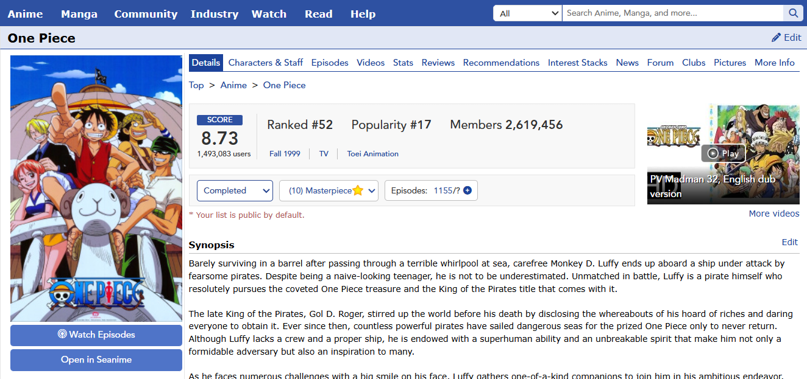
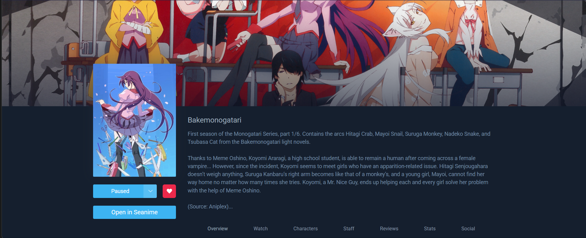
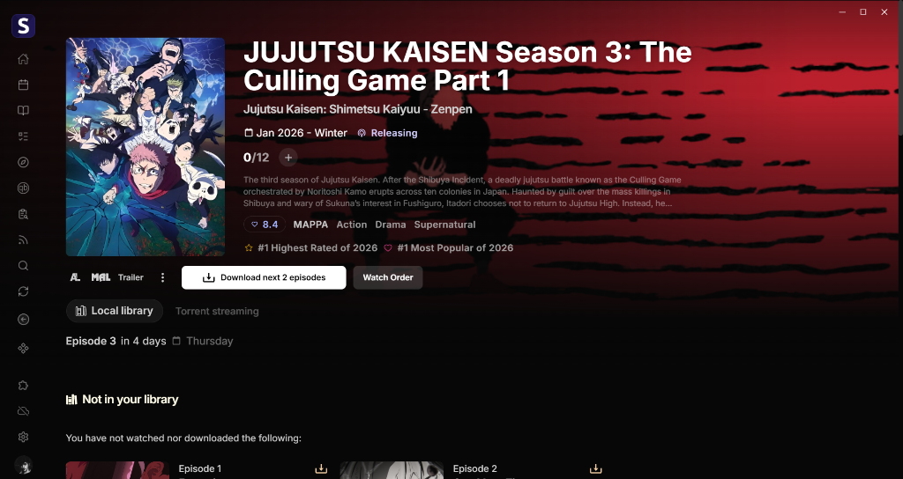

  <h1>Bruuhim's Seanime Extensions</h1>
  
A collection of extensions and manga providers for Seanime.

  
  
  

## Table of Contents

- [Torrent Providers](#torrent-providers)
- [Manga Providers](#manga-providers)
- [Featured Extensions](#featured-extensions)
- [Installation Guide](#installation-guide)
- [Technical Details](#technical-details)

## Torrent Providers

| Provider                  | Description                            | Installation Manifest (URL)                                                                                              |
| :------------------------ | :------------------------------------- | :----------------------------------------------------------------------------------------------------------------------- |
| **nekoBT**                | Public nekoBT torrent provider.        | `https://raw.githubusercontent.com/bruuhim/bruuhim-seanime-extensions/main/anime-torrent-providers/nekobt/nekobt.json`     |

### nekoBT Highlights
- **Media Recommendation Recovery**: Leverages nekoBT search metadata to find media IDs when text queries yield no direct results.
- **Search Waterfall**: Sequentially attempts primary queries, media recommendation pivots, and alternative title variants.
- **Robust Ranking**: Orders results based on seeders, resolution proximity, and episode matching.

 

## Manga Providers

Manga providers utilizing AJAX fallbacks and Cloudflare bypass logic.

| Provider                  | Description                            | Installation Manifest (URL)                                                                                              |
| :------------------------ | :------------------------------------- | :------------------------------------------------ :--------------------------------------------------------------------- |
| **3asq (Arabic)**         | Arabic manga from 3asq.org             | `https://raw.githubusercontent.com/bruuhim/bruuhim-seanime-extensions/main/manga-providers/3asq/3asq.json`               |
| **AzoraMoon (Arabic)**    | Arabic manga from azoramoon.com        | `https://raw.githubusercontent.com/bruuhim/bruuhim-seanime-extensions/main/manga-providers/azoramoon/azoramoon.json`     |
| **OlympusStaff (Arabic)** | Arabic manga from olympustaff.com      | `https://raw.githubusercontent.com/bruuhim/bruuhim-seanime-extensions/main/manga-providers/olympustaff/olympustaff.json` |

 

## Featured Extensions

### [Open-in-Seanime](https://github.com/bruuhim/Open-in-Seanime)

Adds a link to media on MyAnimeList and AniList.

  
  

### [MAL-Button-Seanime](https://github.com/bruuhim/MAL-Button-Seanime)

Adds a "Watch on Seanime" button to the MyAnimeList sidebar.

  

 

## Installation Guide

1. Copy the manifest URL for the desired provider.
2. Open the Seanime dashboard.
3. Navigate to **Settings** > **Extensions**.
4. Paste the URL into the **External Manifest URL** field.
5. Click **Install**.

 

## Testing

1. **Seanime Playground**: Load the manifest and test `search()` or `smartSearch()`.
2. **Fallback Verification**: Test with titles such as `STEEL BALL RUN` to verify media ID recommendation recovery.
3. **Smart Search**: Verify that batch and episode number filters are correctly applied to results.

## Technical Details

- **Media Discovery**: Treatment of initial queries as discovery steps. If results are absent but `recommended_media` is present, the provider pivots to a `media_id` search.
- **Waterfall Search**: Primary query -> Media ID Recovery -> Alt Titles -> Episode Variants -> Broad Fallback.
- **Type Safety**: Results are processed through a strictly-typed mapping pipeline to prevent runtime errors.

---

  Made for the Seanime Community.

