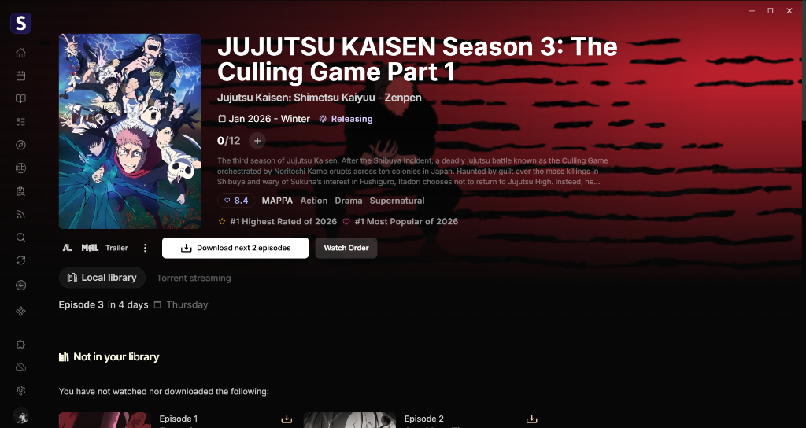

  
  <h1>🚀 Bruuhim's Seanime Extensions</h1>
  
A collection of high-quality extensions and manga providers for the <b>Seanime</b> universe.

  
  
  

## 📖 Table of Contents

- [Manga Providers](#-manga-providers)
- [Torrent Search Providers](#-torrent-search-providers)
- [Seanime Plugins](#-seanime-plugins)
- [Featured Extensions](#-featured-extensions)
- [Installation Guide](#-installation-guide)
- [Technical Details](#-technical-details)

## 🔌 Manga Providers

These providers are optimized for stability, featuring AJAX fallbacks and Cloudflare bypass logic.

| Provider                  | Version | Description                            | Installation Manifest (URL)                                                                                              |
| :------------------------ | :------ | :------------------------------------- | :----------------------------------------------------------------------------------------------------------------------- |
| **3asq (Arabic)**         | 1.0.0   | Premium Arabic manga from 3asq.org     | `https://raw.githubusercontent.com/bruuhim/bruuhim-seanime-extensions/main/src/3asq/3asq.json`               |
| **AzoraMoon (Arabic)**    | 1.0.0   | Fast Arabic manga from azoramoon.com   | `https://raw.githubusercontent.com/bruuhim/bruuhim-seanime-extensions/main/src/azoramoon/azoramoon.json`     |
| **MangaTuk (Arabic)**     | 1.0.0   | Arabic manga from mangatuk.com         | `https://raw.githubusercontent.com/bruuhim/bruuhim-seanime-extensions/main/src/mangatuk/mangatuk.json`       |
| **OlympusStaff (Arabic)** | 1.0.2   | Extensive library from olympustaff.com | `https://raw.githubusercontent.com/bruuhim/bruuhim-seanime-extensions/main/src/olympustaff/olympustaff.json` |

 

## 🌀 Torrent Search Providers

Seanime anime torrent providers to get access to extra torrent indexers.

| Provider | Version | Description | Installation Manifest (URL) |
| :--- | :--- | :--- | :--- |
|  **nekoBT** | 1.0.2 | nekoBT torrent search provider with private-tracker `userkey` support and quality-aware sort-by-best scoring | `https://raw.githubusercontent.com/bruuhim/bruuhim-seanime-extensions/main/src/nekobt/nekobt.json` |

 

## 🧩 Seanime Plugins

Seanime plugin extensions that enhance your anime browsing experience directly within the Seanime app.

| Plugin | Version | Description | Installation Manifest (URL) |
| :--- | :--- | :--- | :--- |
|  **MAL Friend Stats** | 1.0.3 | Shows which of your MyAnimeList friends are watching, have read, or rated the **anime or manga** you're viewing — checks your entire friend list | `https://raw.githubusercontent.com/bruuhim/bruuhim-seanime-extensions/main/src/mal-friend-stats/manifest.json` |

 

## 🧩 Featured Extensions

### [Open-in-Seanime](https://github.com/bruuhim/Open-in-Seanime)

Bridge your anime discovery with your local server. Adds a clean link to media on MyAnimeList and AniList.

  
  

### [MAL-Button-Seanime](https://github.com/bruuhim/MAL-Button-Seanime)

Seamlessly adds a native-feeling "Watch on Seanime" button directly into the MyAnimeList sidebar.

  

 

## 🛠 Installation Guide

1. **Copy** the manifest URL for the provider you want.
2. Open your **Seanime** dashboard.
3. Navigate to **Settings** > **Extensions**.
4. In the **External Manifest URL** field, paste the link.
5. Click **Install**.

_Note: For browser extensions (Open-in-Seanime/MAL-Button), please follow the specific instructions on their respective repository pages._

 

## ⚙️ Technical Details

- **Dual-Method Chapter Extraction**: Combines Static Site Rendering (SSR) and AJAX calls for 99% reliability on Madara/WordPress sites.
- **Parallel Pagination**: Manga chapter lists are fetched from every page at once — no missing chapters, even on sites that paginate 40 per page.
- **Lazy Load Awareness**: Correctly parses `data-src` attributes to ensure zero missing pages in the reader.
- **Smart Ad-Banner Filtering**: Manga pages are whitelisted (`/uploads/manga_`) so promotional banners never leak into the reader.
- **Persistent Smart Caching**: Plugins use Seanime's `$storage` for multi-day caching, with a **version-based cache wipe** so every update starts fresh.
- **Timeout-Bounded Networking**: All external calls have explicit timeouts — a slow or unreachable API can never freeze a plugin.

---

  Made with ❤️ for the Seanime Community.

